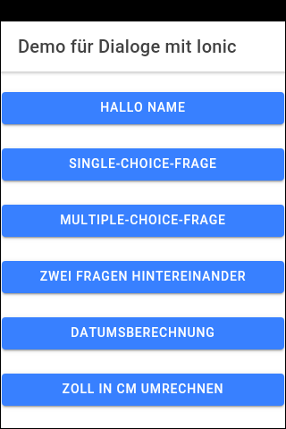
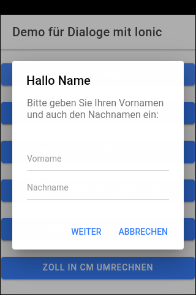
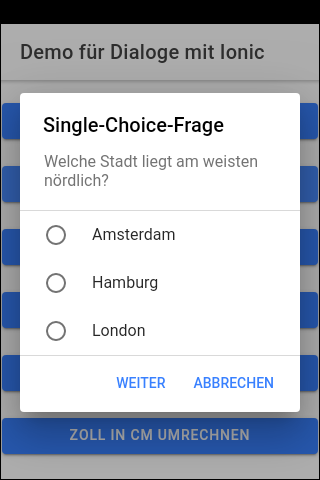
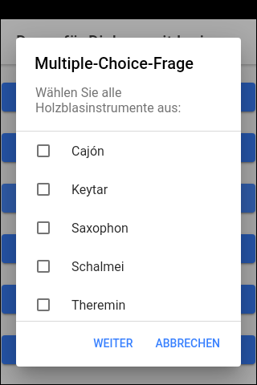
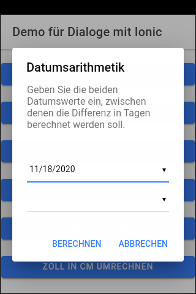
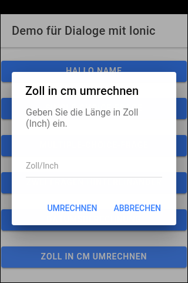

# Ionic-App "Dialog-Demo" #

Simple [Ionic](https://ionicframework.com) app to demonstrate possibilities with
dialogs (instances of [ion-alert](https://ionicframework.com/docs/api/alert)).

 

----
## Screenshots ##

  

  

  

 

----
## Run the app locally ##

Prerequisite: NPM package `ionic` must be installed globally.

1. Clone the repository.

2. Open shell in root folder of cloned repository and execute `npm install`.

3. To run app locall in browser execute `ionic serve`.

 

----
## License ##

See the [LICENSE file](LICENSE.md) for license rights and limitations (BSD 3-Clause License) for the files in this repository.
